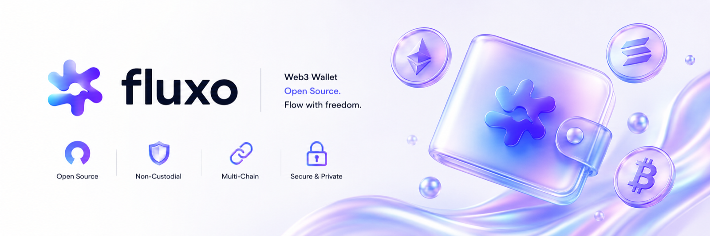

# Fluxo

Fluxo is an open-source headless Web3 wallet core written in Go.

This repository intentionally does not ship an application UI. It provides the wallet engine: HD seed phrase handling, encrypted vault storage formats, in-memory signing sessions, network metadata, and a small WASM bridge for teams that want to build their own interface on top.

## What This Repo Is

- A Go wallet core for BIP39 seed phrases and BIP44 Ethereum account derivation.
- A hardened encrypted vault implementation using Argon2id and XChaCha20-Poly1305.
- A session-based runtime that signs messages without exposing private keys.
- A built-in EVM network registry for Ethereum, Sepolia, Polygon, Arbitrum, Optimism, and Base.
- A secure-element command contract and software emulator for future hardware ports.
- A buildable WASM adapter for browser, desktop, mobile, or embedded clients.

## What This Repo Is Not

- No bundled interface.
- No application shell.
- No hosted wallet app.
- No dapp provider injection.
- No transaction broadcasting.
- No ERC-20 portfolio/indexer layer.

Use Fluxo as wallet infrastructure and build the UX, storage adapter, RPC policy, and product surface that fit your own application.

## Architecture

- `internal/walletcore`: BIP39 seed phrase generation/validation, BIP44 Ethereum derivation, address derivation, and EIP-191 message signing.
- `internal/vault`: vault models, Argon2id key derivation, XChaCha20-Poly1305 encryption, metadata authentication, legacy migration, and session locking.
- `internal/walletruntime`: application boundary for creating/importing/unlocking vaults and signing only through session IDs.
- `internal/secureelement`: firmware-facing command contract plus a software emulator for tests and hardware-port development.
- `internal/networks`: default EVM network metadata.
- `cmd/walletwasm`: WASM bridge exposing the same session-based wallet runtime to host applications.

The runtime never exposes private keys. New wallet creation returns the generated seed phrase only once for backup. Import and unlock flows do not return mnemonic or private key material.

## Vault v3

New vaults use the v3 HD format:

- KDF: Argon2id, 256 MiB memory, 4 passes, `p=1`, 32-byte salt, 32-byte key.
- Cipher: XChaCha20-Poly1305 with a 24-byte nonce.
- AAD: canonical vault header metadata, including version, kind, cipher, KDF params, address, and creation time.
- Migration: legacy v1 PBKDF2-SHA256/AES-GCM vaults are decrypted only during unlock and immediately re-encrypted as legacy private-key v2 vaults.

The KDF policy does not silently downgrade below the v3 defaults.

## Build And Test

```sh
make check
```

This runs Go formatting, tests, vet, and a WASM bridge build.

To build only the WASM adapter:

```sh
make wasm
```

Generated files are written to `dist/wasm/` and are intentionally ignored by git.

## Runtime API

The WASM bridge exposes these Go-owned methods under `globalThis.walletCore`:

- `createVault(password) -> { vault, address, account, accounts, sessionId, mnemonic, networks, activeChainId }`
- `importVault(password, mnemonic) -> { vault, address, account, accounts, sessionId, networks, activeChainId }`
- `unlockVault(vault, password) -> { address, account, accounts, sessionId, networks, activeChainId, migratedVault? }`
- `signMessage(sessionId, message) -> { address, hash, signature }`
- `lock(sessionId)`
- `lockAll()`

The API intentionally has no method that returns a private key.

## Secure Element Track

Fluxo now includes a hardware-wallet direction without pretending that software equals a secure chip:

- `internal/secureelement/protocol.go` defines the command contract for generate, provision, derive, sign, attest, and lock operations.
- `internal/secureelement/software.go` provides a software emulator for test vectors and host integration.
- `firmware/secure-element/README.md` documents the requirements for a real secure-element firmware port.
- `docs/security-audit-checklist.md` tracks the review gates required before custody-grade positioning.

The software emulator is not a custody boundary. A real Ledger/Tangem-class device requires a concrete secure element, vendor SDK, secure boot, anti-rollback, per-device attestation keys, manufacturing provisioning, side-channel review, and independent audits.

## Integration Notes

Integrators are responsible for:

- choosing where encrypted vault JSON is stored;
- enforcing UX-level backup, lock, and reset flows;
- selecting RPC endpoints and privacy policy;
- adding token/indexer support if portfolio balances are needed;
- exposing transaction review and broadcast flows if needed;
- independently reviewing the security model before storing meaningful funds.

## Security

See [SECURITY.md](SECURITY.md).
